# Cribl Stream — Sensitive Data Redaction Pipeline (PCI DSS & HIPAA)

## Overview

This lab demonstrates how to build a sensitive data redaction pipeline in Cribl Stream using the Mask function with custom regex rules. The pipeline intercepts log data in transit and redacts PII, PCI, and PHI fields before they reach downstream destinations such as a SIEM or data lake — ensuring compliance with PCI DSS and HIPAA requirements.

**Key objective:** Prevent sensitive data from ever reaching storage or analytics platforms by masking it at the pipeline layer.

---

## What Gets Redacted

| Data Type | Match Pattern | Replacement |
|---|---|---|
| Credit Card Numbers | Luhn-format card numbers | `[CARD-REDACTED]` |
| Social Security Numbers | `XXX-XX-XXXX` format | `[SSN-REDACTED]` |
| Passwords | `password=<value>` | `[REDACTED]` |
| API Tokens / Keys | `token=sk-...` or `api_key=...` | `[TOKEN-REDACTED]` |
| Email Addresses | Standard email format | `[EMAIL-REDACTED]` |

---

## Pipeline Architecture

```
sensitive_test_logs.log
        │
        ▼
  Cribl Stream
  Worker Group: default
  Pipeline: sensitive_data_redaction
        │
        ├── Mask Function 1 → Credit Card Numbers → [CARD-REDACTED]
        ├── Mask Function 2 → SSNs → [SSN-REDACTED]
        ├── Mask Function 3 → Passwords → [REDACTED]
        ├── Mask Function 4 → API Tokens → [TOKEN-REDACTED]
        └── Mask Function 5 → Email Addresses → [EMAIL-REDACTED]
        │
        ▼
  Redacted output ready for downstream SIEM / data lake ingestion
```

---

## Sample Log Data (Before Redaction)

Raw logs ingested into the pipeline containing multiple sensitive field types:

```
2026-02-23 10:14:22 INFO  user=jsmith action=purchase card=4111111111111111 amount=59.99
2026-02-23 10:14:23 INFO  user=mwilliams ssn=123-45-6789 account_verified=true
2026-02-23 10:14:24 WARN  login_failed user=admin password=SuperSecret123! ip=192.168.1.10
2026-02-23 10:14:25 INFO  api_request token=sk-a1b2c3d4e5f6g7h8i9j0k1l2m3n4o5p6 endpoint=/v1/data
2026-02-23 10:14:26 INFO  new_user email=john.doe@company.com card=5500005555555559 registered=true
2026-02-23 10:14:27 ERROR payment_failed card=378282246310005 error=declined user=tlee@gmail.com
```

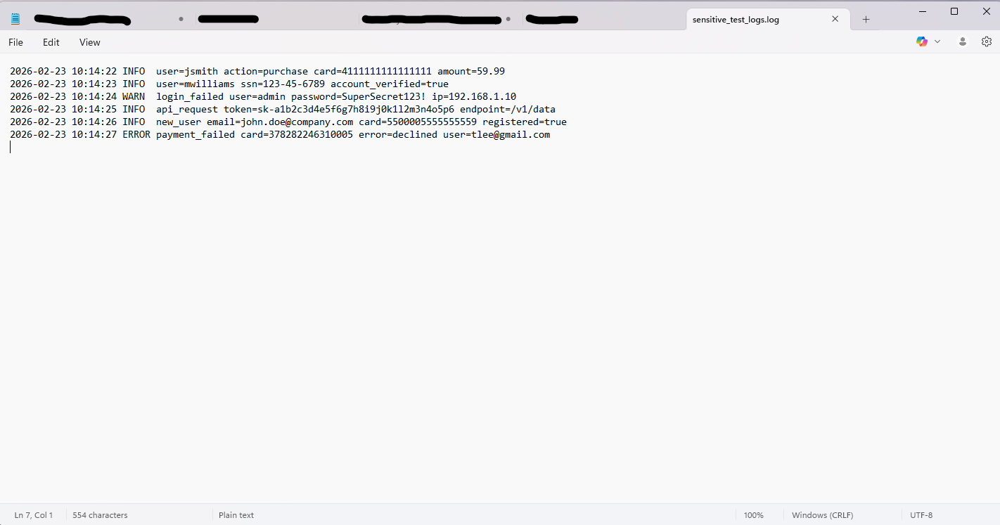

---

## Pipeline Configuration

### Importing Sample Data

Sample log file loaded into Cribl Stream for pipeline testing and validation.

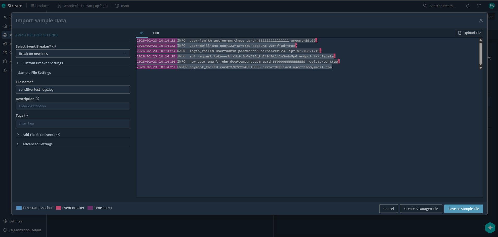

### Pipeline Overview — All 5 Mask Functions Active

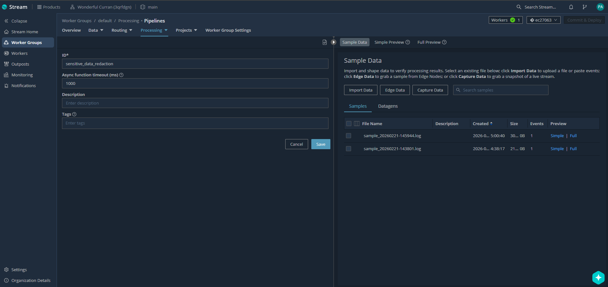

---

## Mask Functions — Step by Step

### Mask 1 — Credit Card Numbers

Regex matches major card formats (Visa, Mastercard, Amex, Discover) using Luhn-compatible pattern.

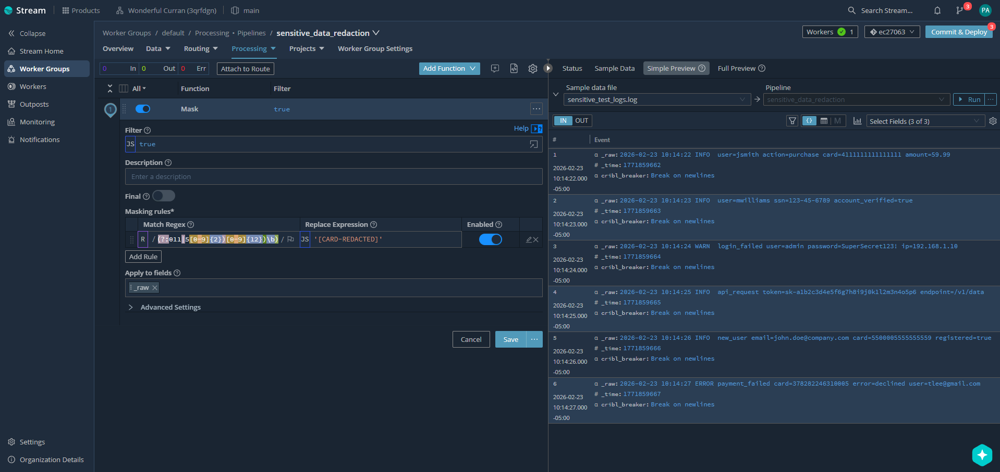

---

### Mask 2 — Social Security Numbers

Regex matches SSN format `XXX-XX-XXXX` using word boundary anchors to prevent partial matches.

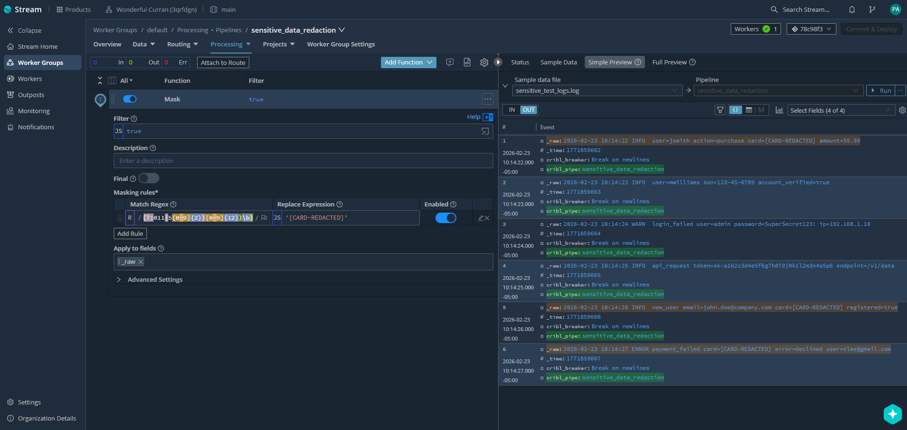

---

### Mask 3 — Passwords

Regex matches `password=<any non-whitespace value>` and replaces the entire key-value pair.

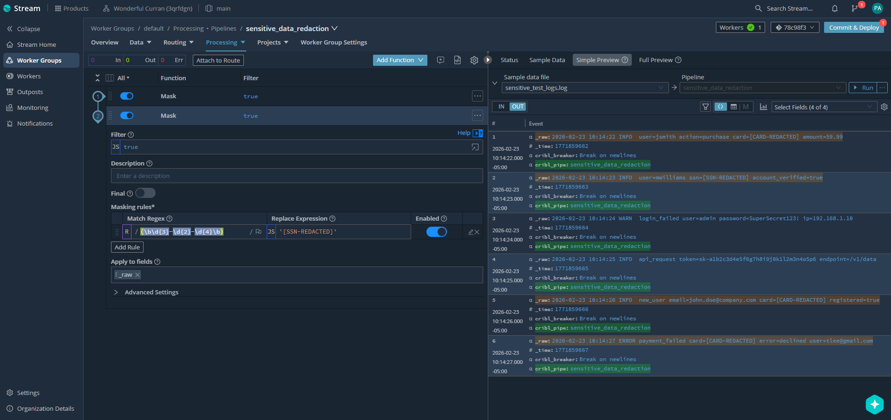

---

### Mask 4 — API Tokens

Regex matches `token=` and `api_key=` prefixes followed by alphanumeric token values including `sk-` prefixed keys.

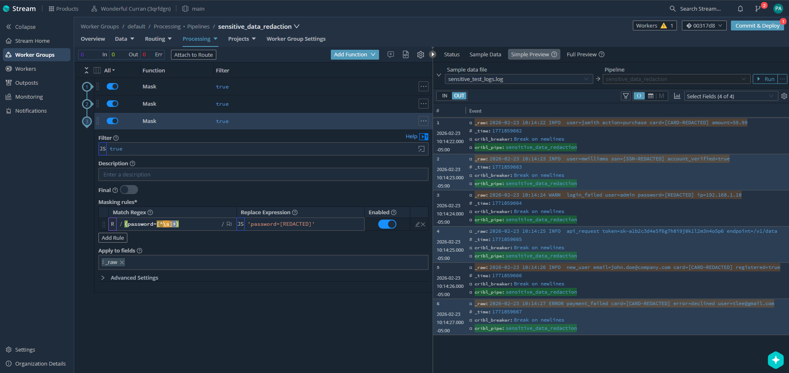

---

### Mask 5 — Email Addresses

Regex matches standard email format `local@domain.tld` across all log events.

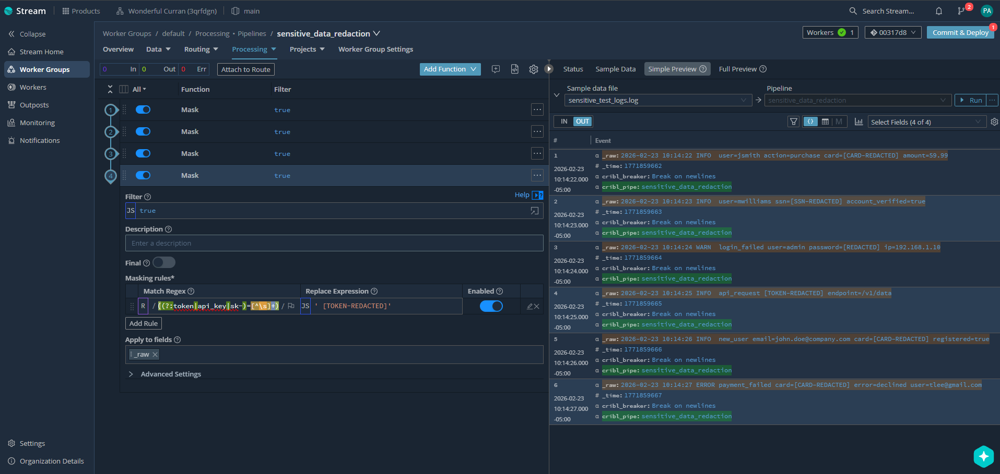

---

### All 5 Masks Active

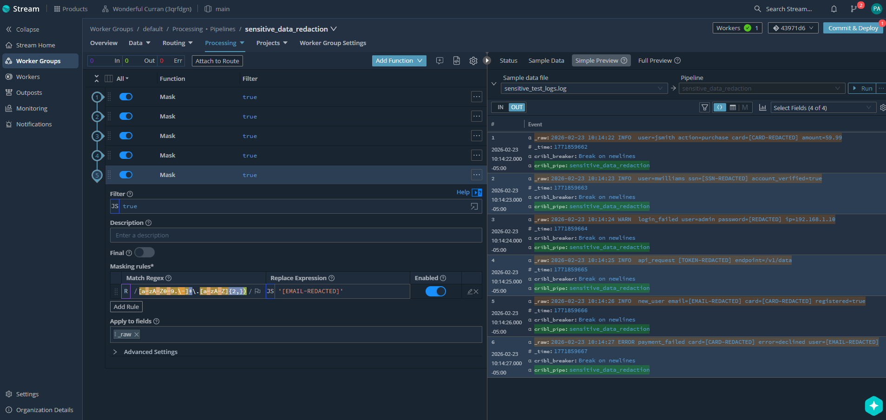

---

## Output — After Redaction

All sensitive fields replaced inline. Downstream systems receive clean, compliant log data with no PII, PCI, or PHI exposure.

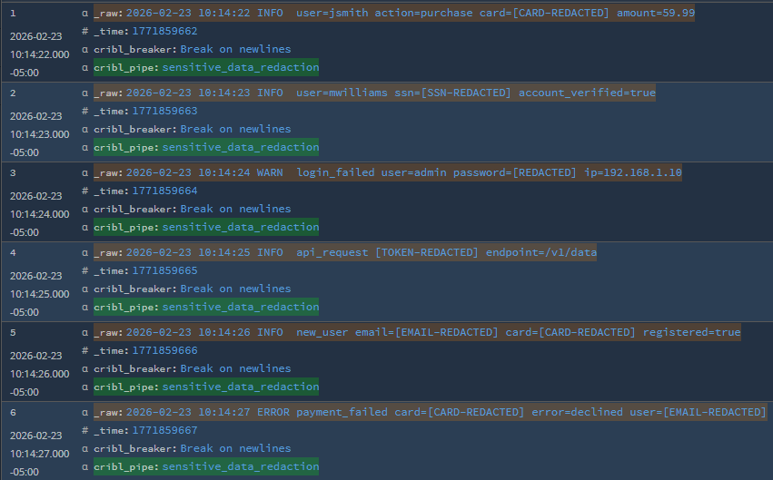

**Redacted output sample:**
```
user=jsmith action=purchase card=[CARD-REDACTED] amount=59.99
user=mwilliams ssn=[SSN-REDACTED] account_verified=true
login_failed user=admin password=[REDACTED] ip=192.168.1.10
api_request [TOKEN-REDACTED] endpoint=/v1/data
new_user email=[EMAIL-REDACTED] card=[CARD-REDACTED] registered=true
payment_failed card=[CARD-REDACTED] error=declined user=[EMAIL-REDACTED]
```

---

## Pipeline Configuration (JSON)

Pipeline exported from Cribl Stream and stored for version control and redeployment.

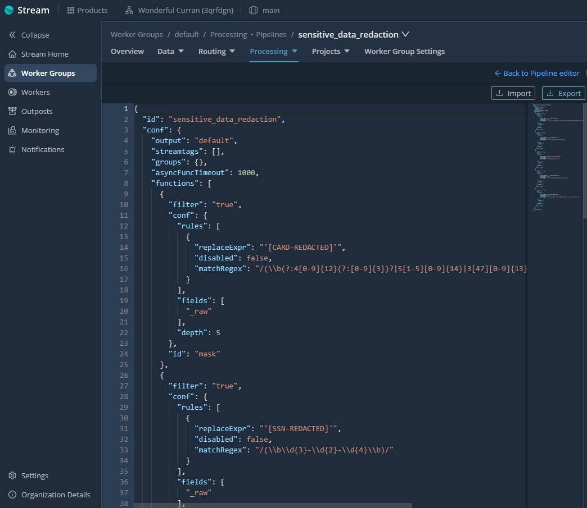
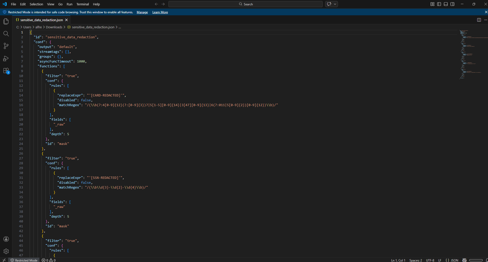

---

## Compliance Relevance

| Framework | Requirement Addressed |
|---|---|
| **PCI DSS** | Req 3.4 — Render PAN unreadable anywhere it is stored or transmitted |
| **HIPAA** | 45 CFR §164.514 — De-identification of PHI before downstream use |
| **NIST 800-53** | SC-28 — Protection of information at rest and in transit |

---

## Tools Used

- **Cribl Stream** — Pipeline processing engine
- **Regex (JavaScript)** — Custom masking rules per data type
- **VS Code** — Pipeline JSON review and version control
- **Sample log file** — Synthetic PII/PCI/PHI data for lab validation

---

## Key Takeaways

- Sensitive data can be masked **in transit** before reaching any storage destination
- Cribl's Mask function applies regex rules inline with zero impact on log structure
- A single pipeline can handle multiple data types simultaneously
- Pipeline config is exportable as JSON for version control and redeployment across environments
